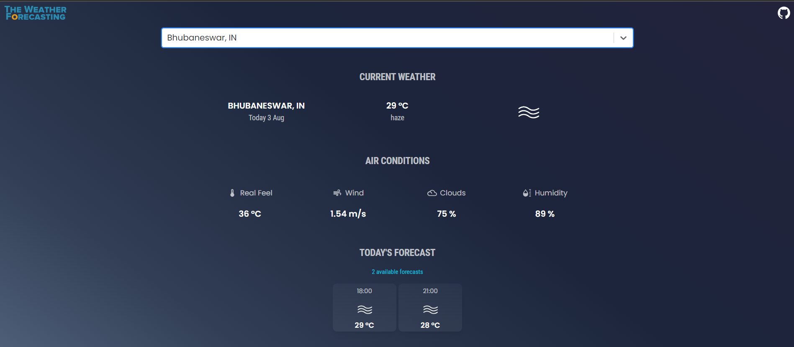

<br/>
<br/>

With [The Weather Forecasting](https://tangerine-lollipop-95ba3e.netlify.app/) user can search locations by city name and observe the weather for the next 5-6 days and 3 hour interval.
<br />
The app is developed using React.js and material-UI.

<br/>


## ⚡ Install


```bash
git clone https://github.com/Rounak107/the_weather_forcasting.git

```

- Install the packages using the command `npm install`

<br/>

## 📙 Used libraries

- `react-js`
- `material-ui`

Check `packages.json` for details

<br/>

## 📄 Todos

- [ ] Styled-components
- [ ] Convert the entire project to TypeScript
- [ ] Unit Testing
- [ ] On launch, find user location weather by utilizing GeolocationAPI/GEOCODING
- [ ] Celcius/Fahrenheit conversion
- [ ] Dark/Light Mode

<br/>

